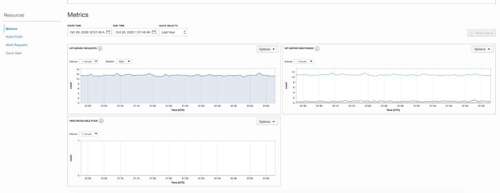
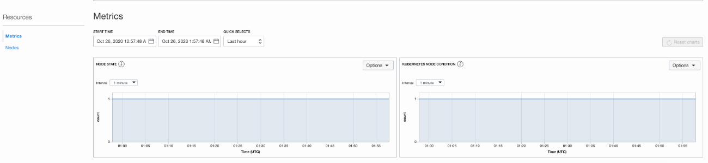
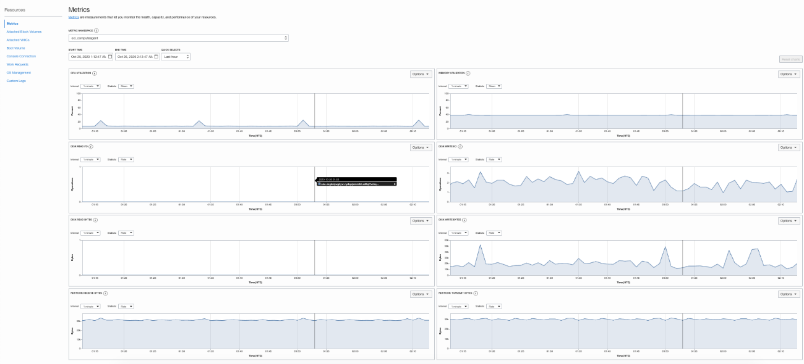
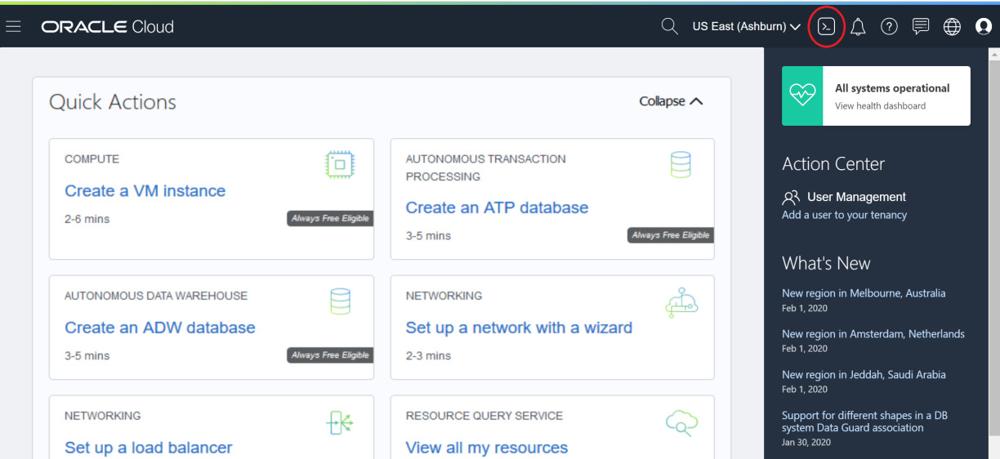
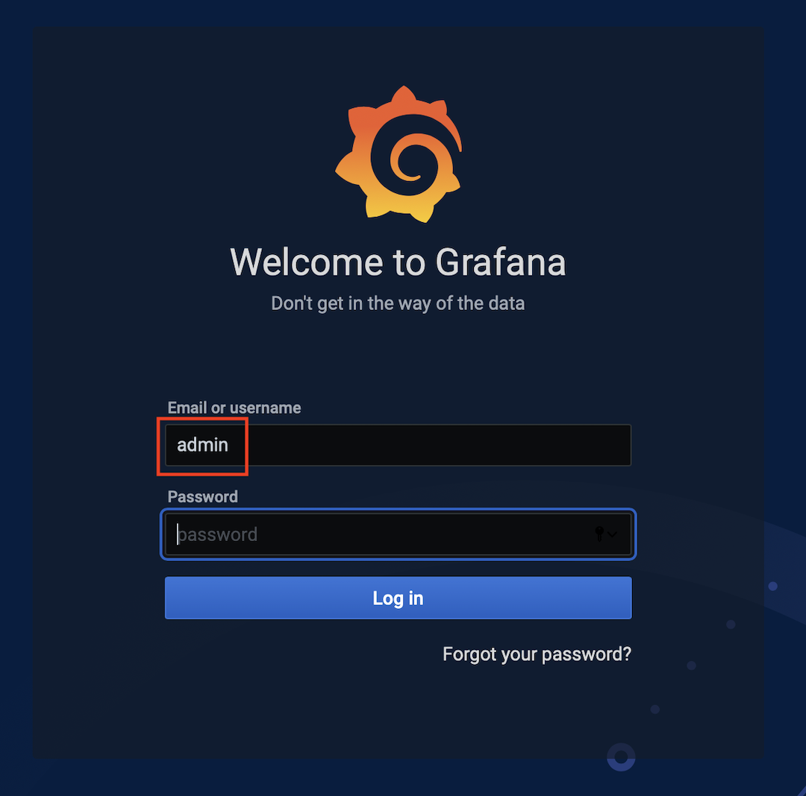
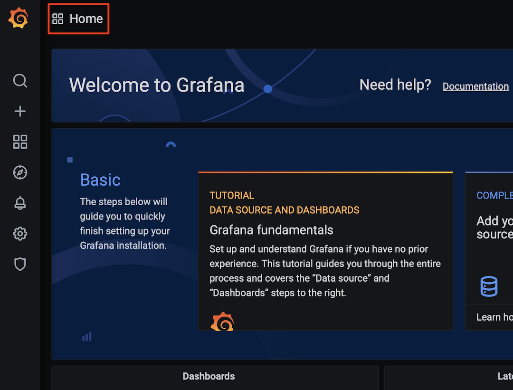
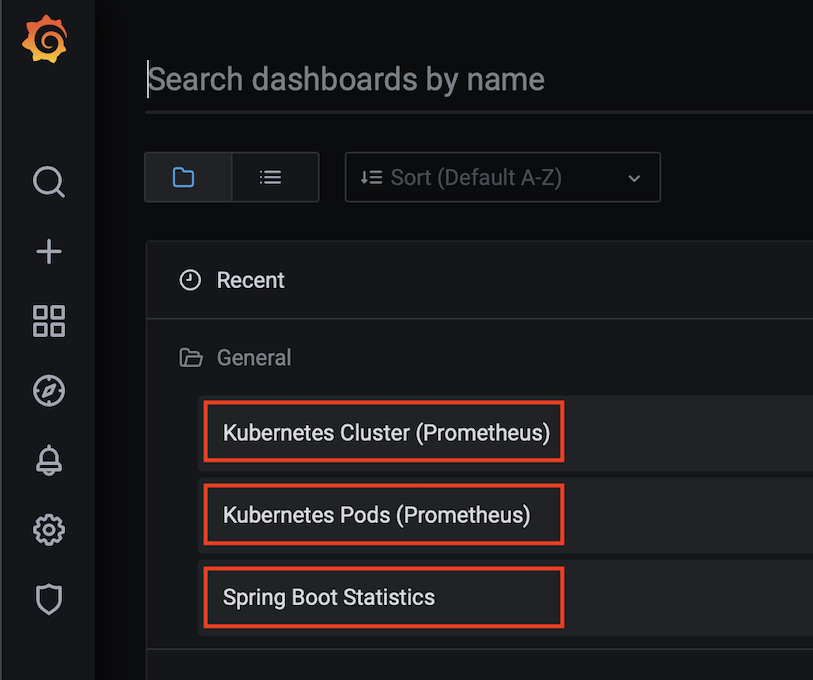

# Monitoring the deployment

## Introduction

Observability helps to understand and explain the state of your systems using a combination of logs, metrics and traces. It helps bringing better visibility into systems.

Estimated Lab Time: 10 minutes

### Objectives

In this lab, you will:

-   Check OKE Cluster, Node Pool and Worker Nodes Metrics with OCI Monitoring Console
-   Use Grafana Dashboards

### Prerequisites

-   Completed the **Deploy the MuShop App** lab and have the app running

Collapse All Tasks

## Task 1: Review OKE Metrics

1.  *OKE Cluster Metrics:* Navigate to **Developer Services -\> Kubernetes Clusters -\>**
2.  Under **Resources -\> Metrics** observe the following metrics
    -   Unschedulable pods, which can be used to trigger node pool scale operations when there are insufficient resources on which to schedule pods.
    -   API Server requests per second, which is helpful to understand any underlying performance issues seen in the Kubernetes API server.
3.  These metrics can also be viewed from OCI Monitoring console under “oci_oke” namespace. Additionally, alarms can be created using industry standard statistics, trigger operators, and time intervals.

    

4.  *OKE Node Pool Metrics:* Navigate to **Developer Services -\> Kubernetes Clusters -\> -\> Node Pools -\>**

    Observe the following node pool metrics:

    -   Node State (If your worker nodes are in Active state as indicated by OCI Compute Service)
    -   Node condition (If your worker node are in Ready state as indicated by OKE API server)

        

5.  *OKE Worker Node Metrics:* Navigate to **Developer Services -\> Kubernetes Clusters -\> -\> Node Pools -\> -\> Nodes -\>**

    Observe the following node metrics:

    -   Activity level from CPU. Expressed as a percentage of total time (busy and idle) versus idle time. A typical alarm threshold is 90 percent.
    -   Space currently in use. Measured by pages. Expressed as a percentage of used pages versus unused pages. A typical alarm threshold is 85 percent.
    -   Activity level from I/O reads and writes. Expressed as reads/writes per second.
    -   Read/Write throughput. Expressed as bytes read/Write per second.
    -   Network receipt/transmit throughput. Expressed as bytes received/transmit per second.

        

## Task 2: Grafana Monitoring

Good news! You already installed Prometheus/Grafana as part of the umbrella chart during setup. Now let's revisit the charts and connect to some Grafana dashboards!

1.  Go back to your Cloud Shell by clicking on the Cloud Shell icon in the Console header. Note that the OCI CLI running in the Cloud Shell will execute commands against the region selected in the Console's Region selection menu when the Cloud Shell was started.

    

2.  List helm releases to check if the **mushop-utils**(Setup) chart is installed

    Copyhelm list --all-namespaces

    Sample response:

    NAME NAMESPACE REVISION UPDATED STATUS CHART APP VERSION

    mushop mushop 1 2020-01-31 21:14:48.511917 -0600 CST deployed mushop-0.1.0 1.0

    mushop-utils mushop-utilities 1 2020-01-31 20:32:05.864769 -0600 CST deployed mushop-setup-0.0.1 1.0

3.  Get the Grafana outputs from the **mushop-utils** (setup chart) installation

    Copyhelm status mushop-utils --namespace mushop-utilities

4.  Find the EXTERNAL-IP assigned to the ingress controller.

    Copykubectl get svc mushop-utils-ingress-nginx-controller --namespace mushop-utilities

5.  Get the auto-generated Grafana **admin** password
6.  Copykubectl get secret -n mushop-utilities mushop-utils-grafana \\

    \-o jsonpath="{.data.admin-password}" \| base64 --decode ; echo

7.  Open to the Grafana dashboard using your browser connecting to http://\< EXTERNAL-IP \>/grafana
8.  Connect to the dashboard with **admin**/**\< password \>**

    

9.  On the Grafana main screen, click on Home to select a Dashboard

    

10. Select the Kubernetes Cluster (Prometheus) Dashboard

    *Note:* MuShop pre-loads dashboards as part of the mushop-utils chart

    

11. Visualize and try the options

    

12. You can try other dashboards by clicking on the Dashboard name and selecting the desired dashboard

    *Note:* You can install other dashboards from the [community](https://grafana.com/grafana/dashboards?dataSource=prometheus) or create your own

## Task 3: Autoscaling

Scaling out a Deployment will ensure new Pods are created and scheduled to Nodes with available resources. Scaling will increase the number of Pods to the new desired state. Kubernetes also supports autoscaling of Pods, but it is outside of the scope of this tutorial. Scaling to zero is also possible, and it will terminate all Pods of the specified Deployment.

This step showcases the [Horizontal Pod Autoscaling](https://kubernetes.io/docs/user-guide/horizontal-pod-autoscaling/) configurations deployed with the MuShop application.

1.  Review the current scaling targets and number of replicas for the MuShop deployments

    Copykubectl get hpa

    Sample response:

    NAME REFERENCE TARGETS MINPODS MAXPODS REPLICAS AGE

    mushop-api Deployment/mushop-api 1%/70% 1 10 1 14m

    mushop-assets Deployment/mushop-assets 1%/70% 1 10 1 14m

    mushop-catalogue Deployment/mushop-catalogue 5%/70% 1 10 1 14m

    mushop-edge Deployment/mushop-edge 2%/70% 1 10 1 14m

    mushop-events Deployment/mushop-events 1%/70% 1 10 1 14m

    mushop-storefront Deployment/mushop-storefront 1%/70% 1 10 1 14m

    mushop-user Deployment/mushop-user 1%/70% 1 10 1 14m

    Depending on the shape of your nodes, the targets will as low as 1% and the number of replicas to 1

2.  Review the ReplicaSet created by the Deployments

    Copykubectl get rs

    Sample response:

    NAME DESIRED CURRENT READY AGE

    mushop-api-9dd66b45b 1 1 1 15m

    mushop-assets-7c87dc946f 1 1 1 15m

    mushop-carts-6c67469876 1 1 1 15m

    mushop-catalogue-6cd5f9bddd 1 1 1 15m

    mushop-edge-7bcbc7f576 1 1 1 15m

    mushop-events-56d6dfff9f 1 1 1 15m

    mushop-fulfillment-7cbbf7cfd4 1 1 1 15m

    mushop-nats-7679846f9f 1 1 1 15m

    mushop-orders-6fd9447846 1 1 1 15m

    mushop-payment-86f4d7897f 1 1 1 15m

    mushop-session-6fdc488cb9 1 1 1 15m

    mushop-storefront-587d5968d4 1 1 1 15m

    mushop-user-85579bdf64 1 1 1 15m

3.  Deploy the load simulation pods

    Copykubectl create -f https://raw.githubusercontent.com/oracle-quickstart/oci-cloudnative/master/src/load/load-dep.yaml

4.  Wait few minutes and check the HPA metrics again

    Copykubectl get hpa

    Sample response:

    NAME REFERENCE TARGETS MINPODS MAXPODS REPLICAS AGE

    mushop-api Deployment/mushop-api 47%/70% 1 10 5 18m2s

    mushop-assets Deployment/mushop-assets 1%/70% 1 10 1 18m2s

    mushop-catalogue Deployment/mushop-catalogue 30%/70% 1 10 3 18m2s

    mushop-edge Deployment/mushop-edge 57%/70% 1 10 6 18m2s

    mushop-events Deployment/mushop-events 18%/70% 1 10 1 18m2s

    mushop-storefront Deployment/mushop-storefront 25%/70% 1 10 2 18m2s

    mushop-user Deployment/mushop-user 20%/70% 1 10 1 18m2s

    Verify that targets increased and the number of replicas have started to increase

    *Note:* Depending on the shapes of the Cluster worker nodes, the usage can have variations to lower or higher numbers.

5.  Return to the Grafana console and review the dashboards

    You will notice an increase of CPU and Memory usage, and variations on the number of replicas

6.  Remove the load simulator

    Copykubectl delete -f https://raw.githubusercontent.com/oracle-quickstart/oci-cloudnative/master/src/load/load-dep.yaml

    Notice that after few minutes the pressure will be reduced and targets will be reduced to the lowest level. At this point the Kubernetes will start to **scale down** and will bring the number of replicas back to minimum.

You may now proceed to the next lab.
